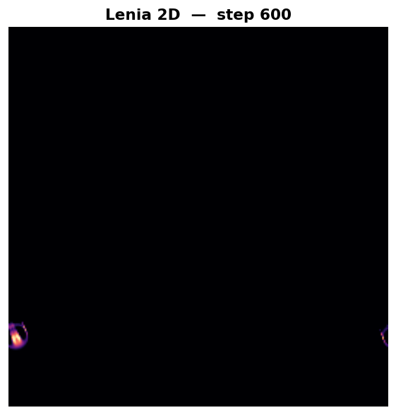
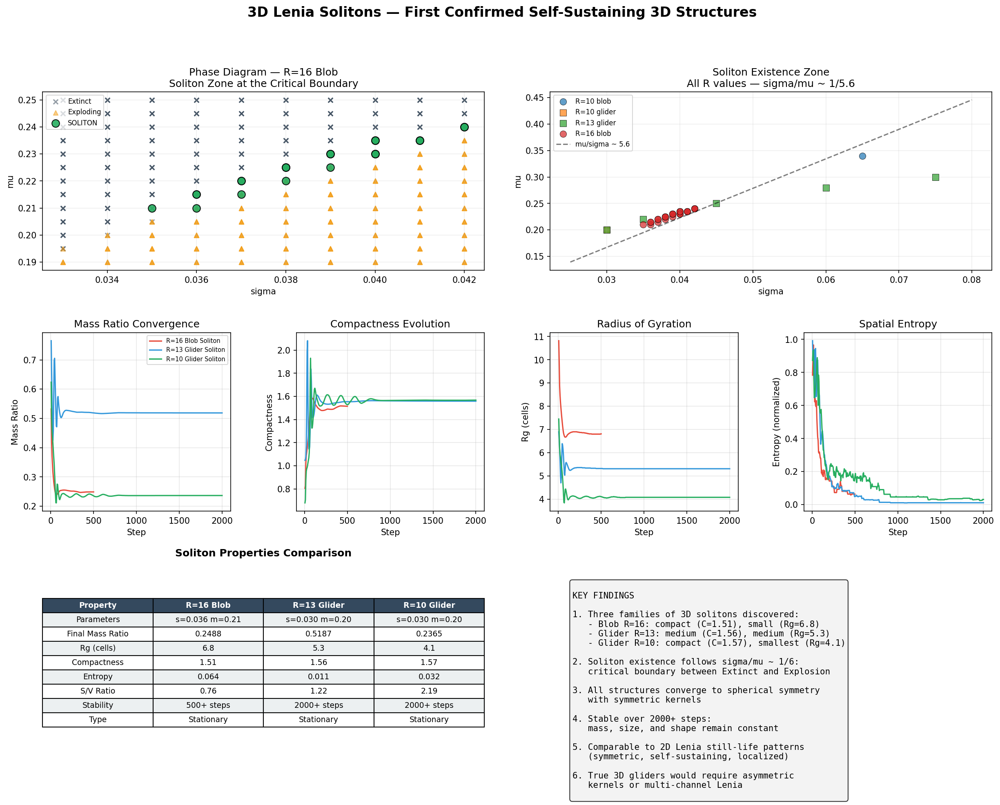
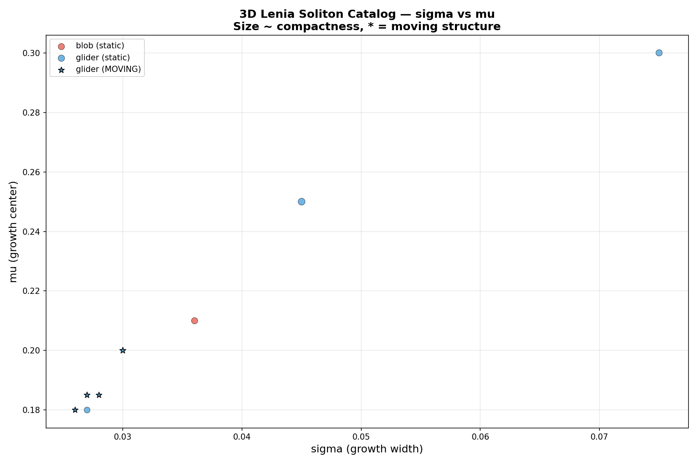
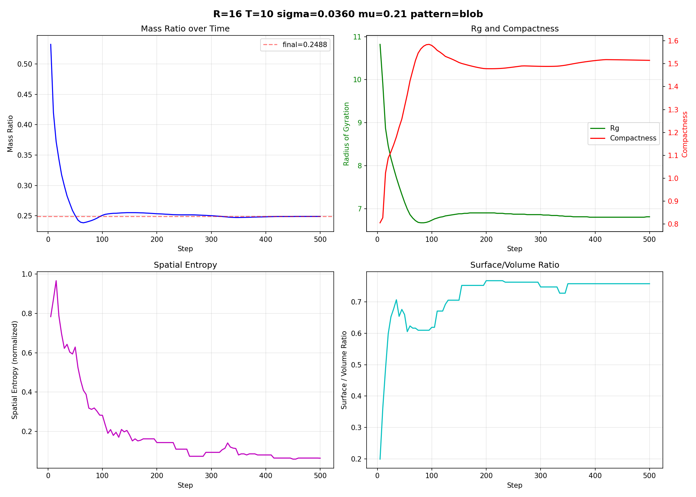
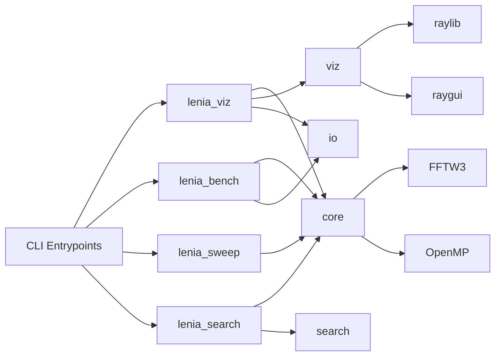

# Parallel 2D/3D Lenia Engine

Implementazione C++17 di Lenia (automi cellulari continui) con:

- simulazione 2D e 3D
- convoluzione FFT (FFTW3)
- parallelizzazione OpenMP
- visualizzazione interattiva 3D con raylib + marching cubes
- tool headless per benchmark, sweep parametrici e ricerca automatica nello spazio dei parametri

## Galleria Rapida

| 2D Sequence | 3D Summary |
|---|---|
|  |  |

| Catalogo Solitoni | Dinamica Massa |
|---|---|
|  |  |

## Cosa Fa Il Progetto

- Evoluzione Lenia su griglie `N x N` (2D) e `N x N x N` (3D) con stato continuo in `[0,1]`
- Kernel annulari configurabili (`R`, `beta`, funzione core) e crescita gaussiana (`mu`, `sigma`)
- Supporto multi-kernel per preset 3D stile "312" (due kernel/growth combinati)
- Rendering 2D a colormap e rendering 3D con isosuperficie, shading e slice ortogonali
- Modalita headless per benchmark scaling, sweep rapidi e ricerca automatica con classificazione pattern (`Extinct`, `Stable`, `Gliding`, etc.)

## Architettura



### Pipeline Numerica Per Step

```text
1) U_hat = FFT(A)
2) U_hat = U_hat * K_hat
3) U = IFFT(U_hat)
4) G = growth(U; mu, sigma)
5) A <- clip(A + dt * G, 0, 1), dt = 1/T
```

Con multi-kernel:
- il campo viene trasformato una sola volta in frequenza
- viene applicata ogni coppia `kernel/growth`
- i contributi di crescita vengono mediati sui kernel attivi

## Requisiti

### Toolchain C++

- `cmake >= 3.20`
- `g++` con supporto C++17
- `fftw3f` (single precision)
- OpenMP (di norma incluso con GCC)

Dipendenze fetchate da CMake quando abilitate:
- raylib `4.0.0` (visualizzazione)
- GoogleTest `v1.14.0` (test)

### Dipendenze Python (analisi/plot/render)

Per gli script in `scripts/*.py`:
- `numpy`
- `pandas`
- `matplotlib`
- `seaborn`
- `scikit-image`

Install esempio:

```bash
python3 -m venv .venv
source .venv/bin/activate
pip install numpy pandas matplotlib seaborn scikit-image
```

### Install Pacchetti Di Sistema

```bash
# Arch Linux
sudo pacman -S cmake gcc fftw

# Ubuntu / Debian
sudo apt update
sudo apt install -y cmake g++ libfftw3-dev pkg-config

# Fedora
sudo dnf install -y cmake gcc-c++ fftw-devel pkgconf-pkg-config
```

## Build

### Build Completa (viz + test)

```bash
cmake -S . -B build-full -DCMAKE_BUILD_TYPE=Release
cmake --build build-full -j"$(nproc)"
```

Output principali:
- `build-full/lenia_viz`
- `build-full/lenia_bench`
- `build-full/lenia_sweep`
- `build-full/lenia_search`
- `build-full/lenia_tests`

### Build Headless (senza GUI)

```bash
cmake -S . -B build-headless \
  -DCMAKE_BUILD_TYPE=Release \
  -DLENIA_BUILD_VIZ=OFF
cmake --build build-headless -j"$(nproc)"
```

### Build Senza Test

```bash
cmake -S . -B build-notests \
  -DCMAKE_BUILD_TYPE=Release \
  -DLENIA_BUILD_TESTS=OFF
cmake --build build-notests -j"$(nproc)"
```

### Build Debug

```bash
cmake -S . -B build-debug -DCMAKE_BUILD_TYPE=Debug
cmake --build build-debug -j"$(nproc)"
```

## Quick Start

### 1) Simulazione Interattiva 2D

```bash
./build-full/lenia_viz --dim 2 --size 256 --pattern orbium --threads 4
```

### 2) Simulazione Interattiva 3D

```bash
./build-full/lenia_viz --dim 3 --size 128 --pattern blob --threads 8
```

### 3) Run Headless Con Log Massa E Snapshot

```bash
./build-full/lenia_viz \
  --headless \
  --dim 3 \
  --size 128 \
  --pattern shell \
  --steps 1000 \
  --threads 8 \
  --mass-log data/shell_mass.csv \
  --snapshot data/shell_state.bin
```

## Controlli Visualizzatore

Camera 3D:
- `tasto destro + drag`: rotazione orbitale
- `rotella`: zoom
- `tasto centrale + drag`: pan

Pannello GUI (destra):
- slider runtime: `mu`, `sigma`, `threshold`
- toggle `Pause`
- `Reset`
- in 3D: slice view con asse `X/Y/Z` + posizione slice

## Eseguibili E CLI

### `lenia_viz` (interattivo + headless)

Argomenti comuni:
- `--dim 2|3`
- `--size N`
- `--radius R`
- `--mu F`
- `--sigma F`
- `--T N`
- `--threads N`
- `--seed N`
- `--beta "1,0.75,0.0833"`
- `--pattern P`
- `--preset P`
- `--config FILE`

Headless specifici:
- `--headless`
- `--steps N`
- `--mass-log FILE`
- `--snapshot FILE` (solo utile in 3D)
- `--cells FILE` (carica stato iniziale binario 3D)

Pattern disponibili:
- 2D: `orbium`, `geminium`, `ring`, `multi`, `random`
- 3D: `blob`, `glider`, `multi`, `shell`, `dipole`, `random`

Preset multi-kernel supportati:
- `fish`, `butterfly`, `ghost`, `divide`, `exotic`, `protoeel`, `embryo`

### `lenia_bench`

Benchmark di scaling su thread count multipli.

Esempio:

```bash
./build-full/lenia_bench \
  --dim 3 \
  --size 128 \
  --threads 1,2,4,8,16 \
  --iterations 100
```

Output CSV automatico:
- `benchmark_2d_<size>.csv` o `benchmark_3d_<size>.csv`

### `lenia_sweep`

Sweep veloce su `sigma` in 3D con sampling della massa.

```bash
./build-full/lenia_sweep \
  --size 128 \
  --threads 8 \
  --pattern shell \
  --radius 13 \
  --mu 0.15 \
  --T 10
```

### `lenia_search`

Ricerca automatica su griglia di parametri (`sigma`, `mu`, `R`, `T`, pattern) con metriche e classificazione.

```bash
./build-full/lenia_search \
  --size 96 \
  --steps 200 \
  --sample-every 10 \
  --threads 8 \
  --sigma-min 0.010 --sigma-max 0.040 --sigma-step 0.002 \
  --mu-min 0.10 --mu-max 0.22 --mu-step 0.02 \
  --radii 8,10,13,16 \
  --T-values 10,20 \
  --patterns blob,shell,dipole,multi,glider \
  > sweep_wide.csv
```

Modalita output:
- default: 1 riga per run (summary)
- `--per-step`: 1 riga per sample temporale

## Workflow Riproducibili

### A) Eseguire Simulazioni Preset 3D (headless)

Usa le celle binarie in `data/cells/*_cells.bin`:

```bash
./scripts/run_simulations.sh ./build-full
```

Genera:
- `data/*_mass.csv`
- `data/*_state.bin`

### B) Benchmark Completo 2D/3D

```bash
./scripts/benchmark.sh build-full
gnuplot scripts/plot_performance.gp
```

### C) Ricerca Parametri + Analisi Automatica

```bash
./build-full/lenia_search --size 96 --steps 200 --threads 8 > sweep_quick.csv
python3 scripts/analyze_search.py sweep_quick.csv --output-dir plots
```

Output tipico:
- `plots/phase_*.png`
- `plots/mass_ratio_*.png`
- `plots/compactness_*.png`
- `plots/class_distribution.png`

### D) Generazione Figure Di Report

Script end-to-end:

```bash
python3 scripts/generate_figures.py --skip-sims --figures-dir plots/generated
```

Nota:
- senza `--figures-dir`, lo script usa il path di default interno
- con `--skip-sims` usa dati gia presenti in `data/`

## Formati Dati

### Binary Grid (`*_cells.bin`, `*_state.bin`)

Layout:
- header: `int32 nz, nr, nc` (12 byte)
- payload: `float32[nz * nr * nc]` in ordine depth-major

Snippet Python:

```python
import struct
import numpy as np

with open("data/fish_state.bin", "rb") as f:
    nz, nr, nc = struct.unpack("iii", f.read(12))
    arr = np.frombuffer(f.read(nz * nr * nc * 4), dtype=np.float32).reshape((nz, nr, nc))
```

### CSV Principali

- Mass log headless: `step,mass`
- Benchmark: `dimension,grid_size,num_threads,num_iterations,total_time_ms,avg_step_time_ms,steps_per_second`
- Search summary: `run_id,sigma,mu,radius,T,pattern,steps_run,early_term,class,...`
- Search per-step: `run_id,sigma,mu,radius,T,pattern,step,mass,mass_ratio,...`

## Qualita E Test

Esecuzione test:

```bash
ctest --test-dir build-full --output-on-failure
```

Suite incluse:
- test unita su `grid`, `fft_engine`, `kernel`, `growth`
- test integrazione 2D/3D su `Lenia`

## Struttura Repository

```text
src/
  core/      # motore numerico Lenia (grid, FFT, kernel, growth, stepper, config)
  viz/       # renderer 2D/3D, marching cubes, camera, GUI overlay, slices
  io/        # benchmark + export CSV/screenshot
  search/    # metriche 3D e classificazione run
tests/
  core/      # test GoogleTest
scripts/
  *.sh       # pipeline benchmark/sweep/simulazioni
  *.py       # analisi e rendering figure
data/
  cells/     # seed binari
  *_mass.csv # tracce temporali
  *_state.bin
plots/       # immagini e grafici generati
docs/        # PRD, TAD, decision record
legacy/      # prototipi storici
extern/
  raygui/    # header raygui
```

## Performance E Scalabilita

Note pratiche:
- la convoluzione FFT domina i costi per griglie grandi
- in 3D la memoria cresce come `O(N^3)`
- per `N>=256` il renderer usa marching-cubes con step adattivo per ridurre carico
- build `Release` e thread tuning (`--threads`) sono essenziali per throughput stabile

## Troubleshooting

- Errore `fftw3f not found`: installa `libfftw3-dev` / `fftw-devel` e riesegui CMake

- GUI non parte su server/headless: usa `--headless` oppure build con `-DLENIA_BUILD_VIZ=OFF`

- Run non riproducibili: imposta `--seed` e usa gli stessi `size`, `T`, `mu`, `sigma`, `radius`, `threads`

- Ricerca troppo lenta: riduci `--size`, `--steps`, range o cardinalita di `--radii`, `--T-values`, `--patterns`

## Riferimenti Scientifici

1. Chan, B.W. (2019), *Lenia - Biology of Artificial Life*, Complex Systems 28(3)
2. Chan, B.W. (2020), *Lenia and Expanded Universe*, ALIFE 2020
3. Lorensen, W.E., Cline, H.E. (1987), *Marching Cubes*, SIGGRAPH
4. Frigo, M., Johnson, S.G. (2005), *The Design and Implementation of FFTW3*, Proc. IEEE

## License

Riferimento license presente in `LENIA-3D/LICENSE`.
